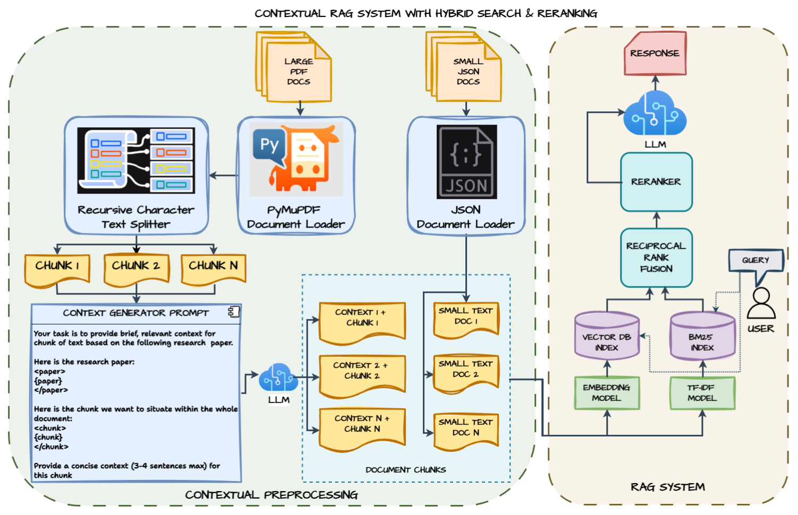

# Contextual RAG with Hybrid Search and Reranking

Naive RAG often struggles to retrieve the right context: chunking can remove document-level context and hurt answer quality. This project addresses that by:

- **Context enrichment:** Adding chunk-level context (relative to the full document) to each chunk.
- **Hybrid retrieval:** Combining **semantic** (vector) search with **BM25** keyword search.
- **Reranking:** Using a reranker model to improve the final set of retrieved chunks.

## Components

1. **LLM** — e.g. GPT 4o-mini or Llama 3.2.
2. **Embeddings** — OpenAI `text-embedding-3-small` or Ollama embeddings.
3. **Chroma** — Vector store for embeddings and semantic search.
4. **BM25** — TF–IDF index for keyword retrieval.
5. **Ensemble retriever** — Fuses vector and BM25 results.
6. **Reranker** — `BAAI/bge-reranker-v2-m3`.
7. **LangChain** — Orchestration and chain wiring.

## Method

### Document preprocessing

- Load JSON and PDF documents with metadata.
- Chunk PDFs with a `Recursive Character Text Splitter`, keeping page number and source title.

### Chunk context generation

- Use an LLM (e.g. GPT 4o-mini or Llama 3.2) to generate a short context (3–4 sentences) for each chunk relative to the source document.
- Prepend this context to the chunk text before indexing.

### Vector indexing (semantic search)

- Embed contextualized chunks with the chosen embedding model.
- Store embeddings in Chroma with cosine similarity.

### BM25 indexing (keyword retrieval)

- Build a BM25 index over chunk TF–IDF representations.

### Ensemble retriever (reciprocal rank fusion)

- Run both semantic and BM25 retrieval; take top-5 from each.
- Normalize scores to [0, 1] and combine with a weight parameter.
- Aggregate scores for documents that appear in both result sets.

### Reranking

- Score query–document pairs with `BAAI/bge-reranker-v2-m3`.
- Return the top-k chunks (default 5) after reranking.

### RAG pipeline

- RAG prompt: `{question}` + `{context}` → `rag_prompt_template` → LLM.
